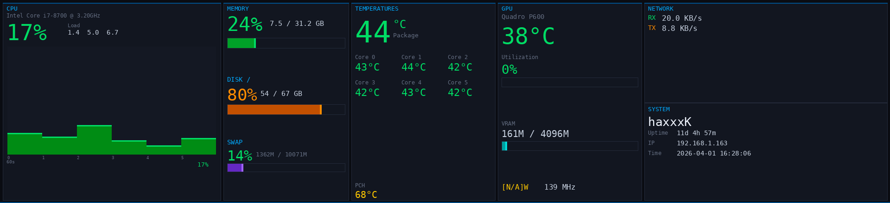

# tinyscreen — Linux Driver for ArtInChip USB Bar Monitors

**Open-source Linux display driver for ArtInChip (33c3:0e02) USB bar monitors**, including the popular ZHAOCAILIN 11.3" 1920x440 stretched LCD displays sold on AliExpress.

These cheap USB-C bar monitors ship with Windows-only drivers and have **zero Linux support** — until now.


## System Monitor Dashboard

Built-in hardware monitoring dashboard designed for the bar form factor:



*Live CPU per-core usage with 60s sparkline, memory/disk/swap, per-core temperatures, NVIDIA GPU stats, network throughput with graphs, and system info — all rendered at 1fps directly to the display.*

## Supported Hardware

| Display | Resolution | Chipset | USB ID | Status |
|---------|-----------|---------|--------|--------|
| ZHAOCAILIN 11.3" Bar LCD | 1920x440 | ArtInChip RISC-V | `33c3:0e02` | Fully working |
| ArtInChip USB Display (0e01) | Various | ArtInChip | `33c3:0e01` | Should work (untested) |
| ArtInChip USB Display (0e04) | Various | ArtInChip | `33c3:0e04` | Should work (untested) |
| ArtInChip USB Display (0e05) | Various | ArtInChip | `33c3:0e05` | Should work (untested) |

If your `lsusb` shows **`33c3:0e0x`** and you're stuck on Linux, this is for you.

## What It Does

- **System monitor dashboard** — CPU cores, temps, GPU, memory, network graphs
- Displays **websites** (live rendering via virtual display + headless browser)
- Plays **YouTube videos** (fetches up to 4K source, scales to display)
- Plays **local video files** (any format ffmpeg supports)
- Shows **static images**
- Runs as a **background daemon** with auto-reconnect
- **Survives USB disconnects** — reconnects and re-authenticates automatically
- **Waits for network targets** — shows status screen until your server is up
- **systemd service** for boot-on-startup dashboard use

## Quick Install

```bash
git clone https://github.com/hevnsnt/artinchip-linux.git
cd artinchip-linux
sudo ./install.sh
```

That's it. The installer handles dependencies, udev rules, and puts `tinyscreen` in your PATH.

## Usage

```bash
# System monitor dashboard (CPU, temps, GPU, memory, network)
tinyscreen --sysmon

# Display a website (live dashboard)
tinyscreen --url https://your-dashboard.example.com/

# Play a YouTube video (fetches up to 4K, scales to fit)
tinyscreen --video "https://www.youtube.com/watch?v=dQw4w9WgXcQ"

# Play a local video (looped)
tinyscreen --video /path/to/video.mp4 --loop

# Show a static image
tinyscreen --image /path/to/wallpaper.jpg

# Test pattern (verify display works)
tinyscreen --test

# Check what's running
tinyscreen --status

# Stop
tinyscreen --off
```

All commands run in the background by default. Add `--fg` to run in foreground.

### Options

| Flag | Description |
|------|-------------|
| `--sysmon` | Live system monitor dashboard |
| `--url URL` | Display a website with a live virtual display + browser |
| `--video URL/FILE` | Play a video file or YouTube URL (up to 4K source) |
| `--image FILE` | Display a static image |
| `--test` | Show test pattern |
| `--off` | Stop the running instance |
| `--status` | Show current status |
| `--fps N` | Target framerate (default: 24) |
| `-q N` | JPEG quality 1-100 (default: auto) |
| `--loop` | Loop video playback |
| `--fg` | Run in foreground (don't daemonize) |

### Auto-Start on Boot

```bash
# Edit the URL in the service file first:
sudo nano /etc/systemd/system/tinyscreen.service

# Or for sysmon, change the ExecStart line to:
#   ExecStart=/usr/bin/python3 /opt/tinyscreen/tinyscreen.py --sysmon --fg

# Enable and start
sudo systemctl enable tinyscreen
sudo systemctl start tinyscreen
```

### Logs

```bash
tail -f /tmp/tinyscreen.log
```

## System Monitor Details

The `--sysmon` mode renders a full-width hardware dashboard with five panels:

| Panel | Content |
|-------|---------|
| **CPU** | Per-core vertical bars, total %, load averages, 60-second sparkline history |
| **Memory** | RAM usage + bar, disk usage + bar, swap usage + bar |
| **Temperatures** | CPU package temp (large), per-core temps grid, PCH temp |
| **GPU** | NVIDIA temp, utilization + bar, VRAM + bar, power draw, clock speed |
| **Network + System** | RX/TX rates, RX/TX sparkline graphs, hostname, uptime, IP, time |

All data is read directly from `/proc` and `/sys` — no `psutil` dependency. NVIDIA GPU stats come from `nvidia-smi` (gracefully skipped if not present).

Colors are dynamic: green < 50%, yellow < 75%, orange < 90%, red >= 90%.

## How It Works

These ArtInChip USB displays require a **proprietary RSA authentication handshake** before they accept any frame data. The Windows driver does this silently, and ArtInChip's official Linux driver (`AiCast`) requires a working DRM display pipeline that conflicts with NVIDIA's proprietary drivers.

**tinyscreen** bypasses the kernel driver entirely and talks directly to the device via USB:

1. **USB enumeration** — Claims the vendor-specific bulk interface (class 0xFF)
2. **RSA authentication** — Two-phase challenge-response required by device firmware:
   - *Phase 1 (auth_dev)*: Host encrypts random challenge with embedded RSA public key, device proves it holds the private key by decrypting and returning the plaintext
   - *Phase 2 (auth_host)*: Device sends RSA-signed blob, host performs public-key recovery and returns the plaintext. (Note: since the public key is embedded in the binary, this phase proves the host has the correct key — not strong host identity, but required by the firmware.)
3. **JPEG frame streaming** — Sends 20-byte frame headers followed by JPEG-encoded frames over USB bulk transfers

The protocol was reverse-engineered from the `aic-render` userspace binary and the `aic_drm_ud` kernel module source.

## Dependencies

Installed automatically by `install.sh`:

- **Python 3.10+** with: `pyusb`, `Pillow`, `cryptography`
- **ffmpeg** — video decoding and X11 capture
- **Xvfb** — virtual framebuffer for URL mode
- **Chromium or Google Chrome** — headless browser for URL mode
- **yt-dlp** *(optional)* — YouTube video support

## Troubleshooting

### "ArtInChip USB display not found"

1. Check the display is plugged in: `lsusb | grep 33c3`
2. Try a different USB cable — many cables that ship with these displays are faulty
3. Check dmesg for USB errors: `dmesg | tail -20`

### "Access denied (insufficient permissions)"

The udev rule didn't take effect. Either:
- Replug the USB cable, or
- Run: `sudo udevadm control --reload-rules && sudo udevadm trigger`

### Display shows nothing after auth

- Make sure you're not also running the `aic_drm_ud` kernel module: `lsmod | grep aic`
- If loaded, blacklist it: `echo "blacklist aic_drm_ud" | sudo tee /etc/modprobe.d/blacklist-aic.conf`
- Or unload it: `sudo rmmod aic_drm_ud`

### NVIDIA + ArtInChip kernel module conflict

If you installed ArtInChip's official `AiCast` Linux driver and Xorg shows "Configure crtc failed" — that's the NVIDIA proprietary driver refusing to share pixmaps. **tinyscreen** avoids this entirely by bypassing the kernel DRM layer.

### Video playback is choppy

- Lower quality for smaller frames: `tinyscreen --video URL -q 50`
- Lower framerate: `tinyscreen --video URL --fps 15`
- USB 2.0 Hi-Speed (480 Mbps) is the bottleneck — ~35 MB/s practical throughput

## Uninstall

```bash
sudo /opt/tinyscreen/uninstall.sh
```

## Technical Details

### USB Protocol

```
Vendor ID:  0x33C3 (ArtInChip)
Product ID: 0x0E02
Interface:  0 (Vendor Specific, Bulk IN EP 0x81, Bulk OUT EP 0x01)

Frame header (20 bytes):
  u32 magic        = 0xA1C62B01
  u32 jpeg_length
  u16 frame_id
  u16 media_format = 0x10 (JPEG)
  u32 reserved     = 0
  u32 magic        = 0xA1C62B01

Auth command (20 bytes, same struct):
  magic = 0xA1C62B10 (auth_dev) or 0xA1C62B11 (auth_host)
  length = 0x100 (RSA key size)

Device parameters via: USB vendor control request 0, IN direction
```

### Device Parameters Response

```
u16 version, chipid, media_format, media_bus,
    media_mode_num, media_width, media_height, media_fps
u8  edid[128]
u8  reserved[16]
```

## Contributing

PRs welcome! Especially for:
- Testing with other ArtInChip display models (0e01, 0e04, 0e05)
- H.264 frame encoding support (the device supports it — `media_format=0x11`)
- Wayland compositor support
- Improved frame rate via H.264 or direct RGB565 mode
- Custom sysmon panel layouts

## License

MIT License. See [LICENSE](LICENSE).

## Acknowledgments

- Protocol reverse-engineered from ArtInChip's official [AiCast Linux driver](https://gitee.com/artinchip/luban-lite) and `aic-render` binary
- ArtInChip Technology Co., Ltd. for the kernel module source (GPL-2.0)

---

**Keywords**: ArtInChip Linux driver, USB bar monitor Linux, ZHAOCAILIN Linux driver, 33c3:0e02 Linux, 1920x440 USB display Linux, stretched bar LCD Linux, AiCast Linux alternative, USB portable monitor Linux driver, ArtInChip RISC-V display, cheap USB monitor Linux, system monitor bar display, hardware dashboard Linux
