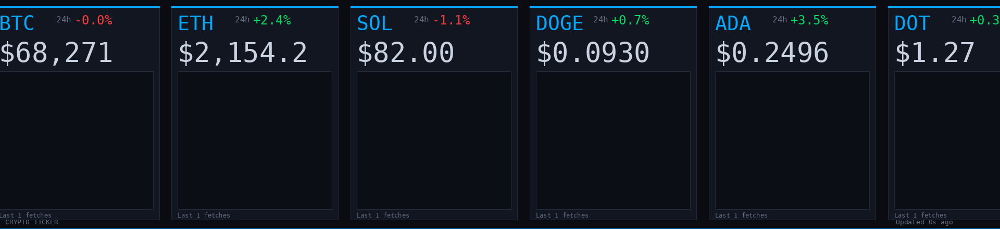
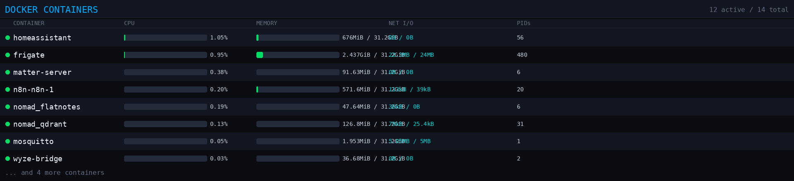
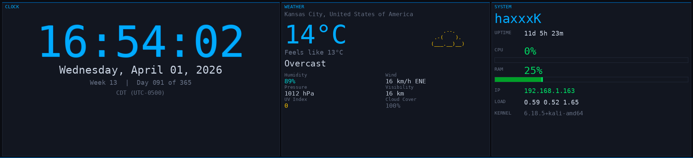
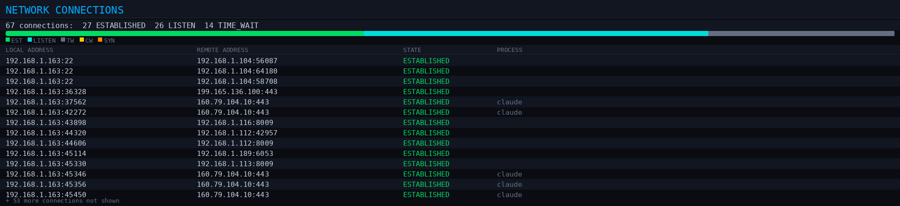

# tinyscreen — Linux Driver for ArtInChip USB Bar Monitors

**Open-source Linux display driver for ArtInChip (33c3:0e02) USB bar monitors**, including the popular ZHAOCAILIN 11.3" 1920x440 stretched LCD displays sold on AliExpress.

These cheap USB-C bar monitors ship with Windows-only drivers and have **zero Linux support** — until now.


## Screenshots

**System Monitor** — CPU cores, temps, GPU, memory, network with sparkline graphs:


**Crypto Ticker** — live prices from CoinGecko with 24h change and sparklines:


**Docker Monitor** — container status, CPU/memory bars, network I/O:


**Clock + Weather** — time, wttr.in weather, system quick stats:


**Network Monitor** — active connections, state breakdown, process names:


## Supported Hardware

| Display | Resolution | Chipset | USB ID | Status |
|---------|-----------|---------|--------|--------|
| ZHAOCAILIN 11.3" Bar LCD | 1920x440 | ArtInChip RISC-V | `33c3:0e02` | Fully working |
| ArtInChip USB Display (0e01) | Various | ArtInChip | `33c3:0e01` | Should work (untested) |
| ArtInChip USB Display (0e04) | Various | ArtInChip | `33c3:0e04` | Should work (untested) |
| ArtInChip USB Display (0e05) | Various | ArtInChip | `33c3:0e05` | Should work (untested) |

If your `lsusb` shows **`33c3:0e0x`** and you're stuck on Linux, this is for you.

## Quick Install

```bash
git clone https://github.com/hevnsnt/artinchip-linux.git
cd artinchip-linux
sudo ./install.sh
```

The installer handles dependencies, udev rules, and puts `tinyscreen` in your PATH.

## Display Modes

### Built-in Dashboards

| Mode | Flag | Description |
|------|------|-------------|
| **System Monitor** | `--sysmon` | CPU per-core bars, temps, GPU, memory, disk, swap, network sparklines |
| **Crypto Ticker** | `--ticker` | Live BTC/ETH/SOL/DOGE/ADA/DOT/LINK/AVAX prices with 24h change |
| **Clock + Weather** | `--clock` | Large clock, wttr.in weather, system quick stats |
| **Matrix Rain** | `--matrix` | Digital rain effect with real syslog data overlay |
| **Audio Visualizer** | `--visualizer` | FFT spectrum analyzer from PulseAudio/PipeWire capture |
| **Now Playing** | `--nowplaying` | MPRIS media info (Spotify, etc.) with progress bar |
| **Docker Monitor** | `--docker` | Container status, CPU/memory bars, network I/O |
| **Network Monitor** | `--netmon` | Active connections, state breakdown, process names |
| **News Crawl** | `--news` | Scrolling RSS headlines from Reuters, BBC, Hacker News |
| **Pomodoro Timer** | `--pomodoro` | 25/5 focus timer with circular progress and color shifts |

### Media & Web

| Mode | Flag | Description |
|------|------|-------------|
| **Website** | `--url URL` | Live virtual display + headless browser |
| **YouTube** | `--video URL` | Fetches up to 4K source, scales to display |
| **Local Video** | `--video FILE` | Any format ffmpeg supports, `--loop` to repeat |
| **Static Image** | `--image FILE` | Display any image file |

## Usage

```bash
# Single mode
tinyscreen --sysmon
tinyscreen --matrix
tinyscreen --ticker
tinyscreen --docker

# Rotate through modes (30 seconds each)
tinyscreen --show all --delay 30

# Rotate specific modes
tinyscreen --show sysmon matrix ticker docker --delay 20

# Media
tinyscreen --url https://your-dashboard.example.com/
tinyscreen --video "https://www.youtube.com/watch?v=dQw4w9WgXcQ"
tinyscreen --video /path/to/video.mp4 --loop

# Rotate the display output
tinyscreen --sysmon --rotate 180
tinyscreen --show all --rotate 90

# Just run — uses config.yml defaults
tinyscreen

# Control
tinyscreen --status
tinyscreen --off
```

All commands run in the background by default. Add `--fg` to run in foreground.

### All Options

| Flag | Description |
|------|-------------|
| `--show MODE [MODE...]` | Rotate through modes (`all` for all, or list names) |
| `--delay N` | Seconds per mode when rotating (default: 30) |
| `--rotate N` | Rotate output 0/90/180/270 degrees |
| `--fps N` | Target framerate (default: 24) |
| `-q N` | JPEG quality 1-100 (default: auto) |
| `--loop` | Loop video playback |
| `--fg` | Run in foreground (don't daemonize) |
| `--off` | Stop the running instance |
| `--status` | Show current status |
| `--test` | Show test pattern |

## Configuration

When you run `tinyscreen` with no arguments, it reads `/opt/tinyscreen/config.yml`:

```yaml
# What to run by default
mode: rotate

# Modes to cycle through
rotate:
  modes:
    - sysmon
    - matrix
    - ticker
    - docker
    - clock
  delay: 30  # seconds per mode

# URL mode settings
url: http://your-dashboard.local:8421/

# Global settings
quality: 80            # JPEG quality 1-100
fps: 24                # target framerate
rotate_display: 0      # 0, 90, 180, or 270 degrees
```

CLI flags always override config.yml.

### Auto-Start on Boot

```bash
# Edit the systemd service to your preference:
sudo nano /etc/systemd/system/tinyscreen.service

# Enable and start
sudo systemctl enable tinyscreen
sudo systemctl start tinyscreen
```

### Logs

```bash
tail -f /tmp/tinyscreen.log
```

## How It Works

These ArtInChip USB displays require a **proprietary RSA authentication handshake** before they accept any frame data. The Windows driver does this silently, and ArtInChip's official Linux driver (`AiCast`) requires a working DRM display pipeline that conflicts with NVIDIA's proprietary drivers.

**tinyscreen** bypasses the kernel driver entirely and talks directly to the device via USB:

1. **USB enumeration** — Claims the vendor-specific bulk interface (class 0xFF)
2. **RSA authentication** — Two-phase challenge-response required by device firmware:
   - *Phase 1 (auth_dev)*: Host encrypts random challenge with RSA public key, device decrypts with private key, returns plaintext
   - *Phase 2 (auth_host)*: Device sends RSA-signed blob, host recovers plaintext via public key, returns it
3. **JPEG frame streaming** — 20-byte frame headers + JPEG data over USB bulk transfers

The protocol was reverse-engineered from the `aic-render` userspace binary and the `aic_drm_ud` kernel module source.

## Dependencies

Installed automatically by `install.sh`:

- **Python 3.10+** with: `pyusb`, `Pillow`, `cryptography`, `PyYAML`
- **ffmpeg** — video decoding and X11 capture
- **Xvfb** — virtual framebuffer for URL mode
- **Chromium or Google Chrome** — headless browser for URL mode
- **yt-dlp** *(optional)* — YouTube video support
- **numpy** *(optional)* — audio visualizer FFT
- **feedparser** *(optional)* — RSS news crawl
- **requests** *(optional)* — crypto ticker, weather

## Troubleshooting

### "ArtInChip USB display not found"

1. Check the display is plugged in: `lsusb | grep 33c3`
2. Try a different USB cable — many cables that ship with these displays are faulty
3. Check dmesg for USB errors: `dmesg | tail -20`

### "Access denied (insufficient permissions)"

Replug the USB cable, or run: `sudo udevadm control --reload-rules && sudo udevadm trigger`

### Display shows nothing after auth

Make sure the `aic_drm_ud` kernel module isn't loaded: `lsmod | grep aic`. If loaded, blacklist it: `echo "blacklist aic_drm_ud" | sudo tee /etc/modprobe.d/blacklist-aic.conf`

### NVIDIA + ArtInChip kernel module conflict

If you installed ArtInChip's official `AiCast` driver and Xorg shows "Configure crtc failed" — that's the NVIDIA driver refusing to share pixmaps. **tinyscreen** avoids this by bypassing the kernel DRM layer entirely.

### Video playback is choppy

Lower quality (`-q 50`) or framerate (`--fps 15`). USB 2.0 Hi-Speed (480 Mbps) is the bottleneck.

## Uninstall

```bash
sudo /opt/tinyscreen/uninstall.sh
```

## Technical Details

### USB Protocol

```
Vendor ID:  0x33C3 (ArtInChip)
Product ID: 0x0E02
Interface:  0 (Vendor Specific, Bulk IN EP 0x81, Bulk OUT EP 0x01)

Frame header (20 bytes):
  u32 magic        = 0xA1C62B01
  u32 jpeg_length
  u16 frame_id
  u16 media_format = 0x10 (JPEG)
  u32 reserved     = 0
  u32 magic        = 0xA1C62B01

Auth command (20 bytes, same struct):
  magic = 0xA1C62B10 (auth_dev) or 0xA1C62B11 (auth_host)
  length = 0x100 (RSA key size)
```

### Project Structure

```
/opt/tinyscreen/
├── tinyscreen.py      # main driver + daemon + all mode dispatch
├── tinyscreen         # shell wrapper (handles sudo)
├── sysmon.py          # system monitor renderer
├── config.yml         # default configuration
├── modes/
│   ├── ticker.py      # crypto price ticker
│   ├── clock.py       # clock + weather + system info
│   ├── matrix.py      # matrix digital rain
│   ├── visualizer.py  # audio spectrum analyzer
│   ├── nowplaying.py  # MPRIS now playing
│   ├── docker_mon.py  # docker container monitor
│   ├── netmon.py      # network connections
│   ├── newscrawl.py   # RSS news crawl
│   └── pomodoro.py    # focus timer
├── install.sh
└── uninstall.sh
```

## Contributing

PRs welcome! Especially for:
- Testing with other ArtInChip display models (0e01, 0e04, 0e05)
- New display modes
- H.264 frame encoding (device supports `media_format=0x11`)
- Wayland compositor support
- Direct RGB565 mode for higher frame rates

## License

MIT License. See [LICENSE](LICENSE).

## Acknowledgments

- Protocol reverse-engineered from ArtInChip's official [AiCast Linux driver](https://gitee.com/artinchip/luban-lite) and `aic-render` binary
- ArtInChip Technology Co., Ltd. for the kernel module source (GPL-2.0)

---

**Keywords**: ArtInChip Linux driver, USB bar monitor Linux, ZHAOCAILIN Linux driver, 33c3:0e02 Linux, 1920x440 USB display Linux, stretched bar LCD Linux, AiCast Linux alternative, USB portable monitor Linux driver, ArtInChip RISC-V display, cheap USB monitor Linux, system monitor bar display, hardware dashboard Linux, crypto ticker display, matrix rain display, docker monitor display
